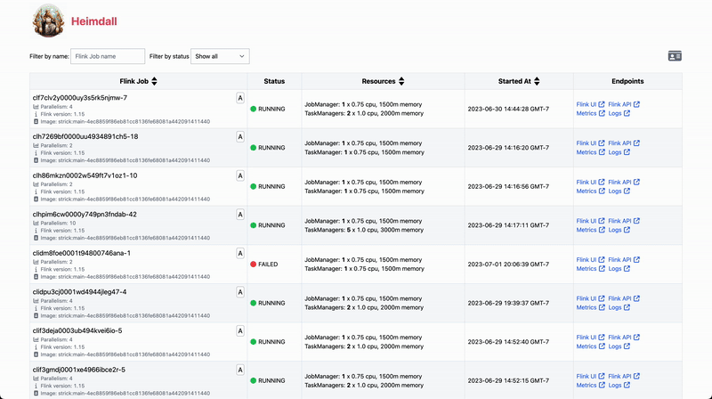

# Heimdall

Heimdall is a dashboard for managing Flink jobs and deployments. Built-in Flink UI is extremely useful when dealing with
a single job, but what if you have 10, 20 or 100? Heimdall helps to keep track of all your Flink jobs, search, filter, sort and navigate them.

Currently, Heimdall only supports Flink jobs deployed with [Flink Kubernetes Operator](https://ci.apache.org/projects/flink/flink-kubernetes-operator-docs-stable/).



## Quick (and Dirty) Start

```bash
kubectl apply -f https://raw.githubusercontent.com/sap1ens/heimdall/main/tools/k8s-operator/service-account.yaml
kubectl run heimdall --image=ghcr.io/sap1ens/heimdall:0.2.0 --port=8080 --overrides='{ "spec": { "serviceAccount": "heimdall-service-account" }  }'
kubectl port-forward heimdall 8080:8080
open http://localhost:8080
```

This creates a pod and uses port-forwarding for accessing the dashboard. You probably want to convert it to a deployment 
with a service using your standard Kubernetes configuration tooling. 

## Job Locators

Job locator (implements `FlinkJobLocator` interface) is a mechanism for discovering running Flink jobs in Heimdall.

### K8sOperatorFlinkJobLocator

Can be enabled with `heimdall.joblocator.k8s-operator.enabled` config. Currently, enabled by default. It loads 
`flinkdeployment` custom resource (CR) created by the Flink Kubernetes Operator.

A service account with read-only access to `flinkdeployment` CR is required. See [tools/k8s-operator/service-account.yaml](tools/k8s-operator/service-account.yaml) for an example.

## Configuration

### Common

| Environment variable                      | Default                           | Description                                                                                                                    |
|-------------------------------------------|-----------------------------------|--------------------------------------------------------------------------------------------------------------------------------|
| HEIMDALL_PATTERNS_DISPLAY_NAME            | $jobName                          | Pattern for showing Flink job name. Metadata fields (e.g. Kubernetes labels) can be accessed via `$metadata.labelName` syntax. |
| HEIMDALL_ENDPOINT_PATH_PATTERNS_FLINK_UI  | http://localhost/$jobName/ui      | Pattern for the Flink UI endpoint. `$jobName` will be substituted.                                                             |
| HEIMDALL_ENDPOINT_PATH_PATTERNS_FLINK_API | http://localhost/$jobName/api     | Pattern for the Flink API endpoint. `$jobName` will be substituted.                                                            |
| HEIMDALL_ENDPOINT_PATH_PATTERNS_METRICS   | http://localhost/$jobName/metrics | Pattern for the Metrics endpoint. `$jobName` will be substituted.                                                              |
| HEIMDALL_ENDPOINT_PATH_PATTERNS_LOGS      | http://localhost/$jobName/logs    | Pattern for the Logs endpoint. `$jobName` will be substituted.                                                                 |

### K8sOperatorFlinkJobLocator

| Environment variable                                | Default | Description                  |
|-----------------------------------------------------|---------|------------------------------|
| HEIMDALL_JOBLOCATOR_K8S_OPERATOR_ENABLED            | true    | Is this locator enabled?     |
| HEIMDALL_JOBLOCATOR_K8S_OPERATOR_NAMESPACE_TO_WATCH | default | Kubernetes namespace to use. |

## Development

This project uses Quarkus, the Supersonic Subatomic Java Framework.

If you want to learn more about Quarkus, please visit its website: https://quarkus.io/ .

### Running the application in dev mode

You can run your application in dev mode that enables live coding using:
```shell script
./gradlew quarkusDev
```

### Packaging and running the application

The application can be packaged using:
```shell script
./gradlew build
```

It produces the `quarkus-run.jar` file in the `build/quarkus-app/` directory.
Be aware that it’s not an _über-jar_ as the dependencies are copied into the `build/quarkus-app/lib/` directory.

The application is now runnable using `java -jar build/quarkus-app/quarkus-run.jar`.

If you want to build an _über-jar_, execute the following command:

```shell script
./gradlew build -Dquarkus.package.type=uber-jar
```

The application, packaged as an _über-jar_, is now runnable using `java -jar build/*-runner.jar`.

---

The project is sponsored by [Goldsky](https://goldsky.com) ❤️.
